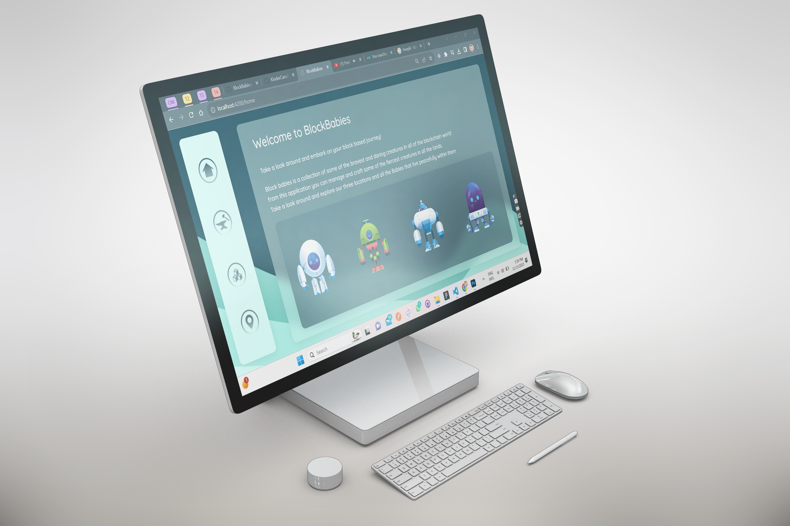
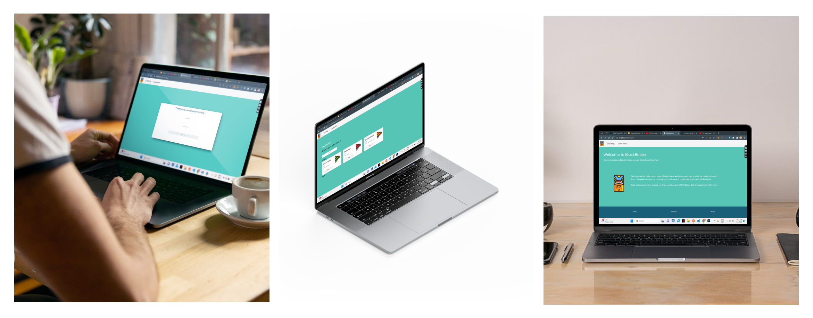
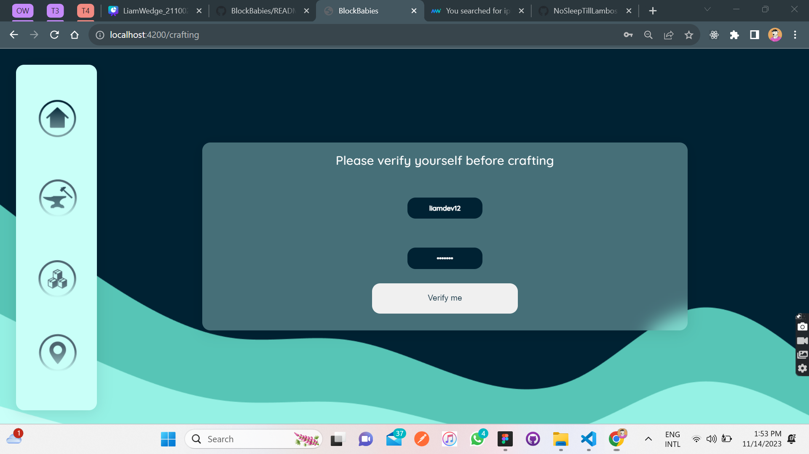
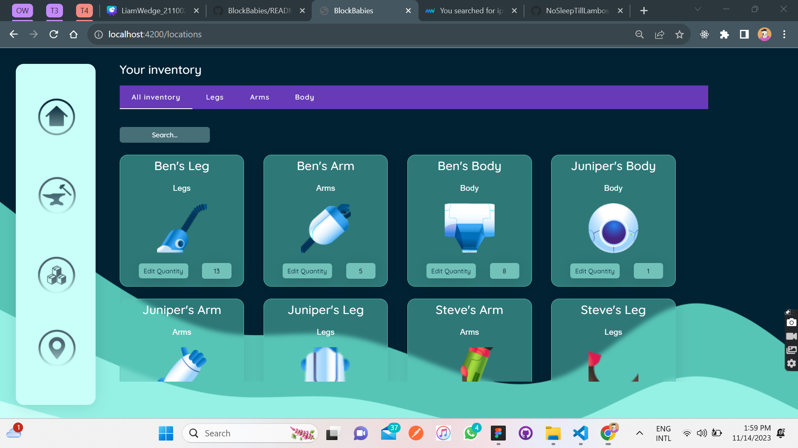
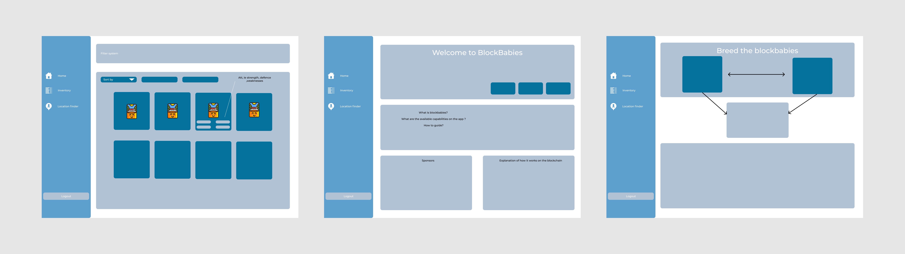

<!-- Repository Information & Links-->
<br />


<!-- HEADER SECTION -->
<h5 align="center" style="padding:0;margin:0;">Liam Wedge</h5>
<h5 align="center" style="padding:0;margin:0;">21100218</h5>
<h6 align="center">DV300 - Term 1 Project | 2023</h6>
</br>
<p align="center">

  <a href="https://github.com/NoSleepTillLambos/BlockBabies">
    
  </a>
  
  <h3 align="center">Block Babies</h3>

  <p align="center" font-weight="bold">
   An Angular and Typescript project developed to allow users to create and manage a intuitive inventory system
    
   <br />
   <br />
    ·
    
</p>
<!-- TABLE OF CONTENTS -->

## Table of Contents

- [Getting Started](#getting-started)
  - [Prerequisites](#prerequisites)
  - [How to install](#how-to-install)
- [Features and Functionality](#features-and-functionality)
- [Concept Process](#concept-process)
  - [Ideation](#ideation)
  - [WireFrames](#wireframes)
  - [Custom UI](#user-flow)
- [Development Process](#development-process)
  - [Implementation Process](#implementation-process)
  - [Future Implementation](#peer-reviews)
- [Final Outcome](#final-outcome)
  - [Mockups](#mockups)
  - [Video Demonstration](#video-demonstration)
- [Conclusion](#conclusion)
- [License](#license)
- [Contact](liamwedge00@gmail.com)
- [Acknowledgements](#acknowledgements)

<!-- header image of project -->



### Project Description

**Block babies is centred around the world of blockchain with specific focus on <a src="https://axieinfinity.com/">Axie infinity<a/> and its ecosystem, the web app allows users to craft their characters and maintain the craftable items within the inventory**

### Built With


<!-- GETTING STARTED -->

## Getting Started

The following instructions will get you a copy of the project up and running on your local machine for development and testing purposes.

### Prerequisites

Ensure that you have the latest version of [NPM](https://www.npmjs.com/) installed on your machine. The [GitHub Desktop](https://desktop.github.com/) program will also be required.

### How to install

### Installation

Here are a couple of ways to clone this repo:

1.  GitHub Desktop </br>
    Enter `https://github.com/NoSleepTillLambos/BlockBabies` into the URL field and press the `Clone` button.

2.  Clone Repository </br>
    Run the following in the command-line to clone the project:

    ```sh
    git clone https://github.com/NoSleepTillLambos/BlockBabies
    ```

        Open `Software` and select `File | Open...` from the menu. Select cloned directory and press `Open` button

3.  Install Dependencies </br>
    Run the following in the command-line to install all the required dependencies:

    ```sh
    npm install
    ```

4.  An API key is not required for this installation

<!-- FEATURES AND FUNCTIONALITY-->
<!-- You can add the links to all of your imagery at the bottom of the file as references -->

## Previous features/functionality



### Feature 1  🎉 



</br>

**Route protection before crafting new items from the inventory**

### Feature 2  🎉 



</br>

**Inventory management | cycling through and searching for specific data if need be**

### Feature 3 🎉 


</br>

**Crafting elements using the available quantities on hand**

## Concept Process

<!-- Briefly explain your concept ideation process -->

**My main source of inspiration was drawn from Axie infinity, so a lot of my inspiration was designed around them and their website and agenda** 

**I have quite a lot of experience using and a lot of time within the app so it helped a lot with my designs and the way in which i wanted people to naviagte through the app**

### Road Map and conceptual process 📌

**Planning the crafting section and the inner workins regarding route protection and authentication to ensure the inventories are protected**
</br>



<!-- DEVELOPMENT PROCESS -->

## Development Process 🔨

**A large part of my inspiration came from axie infinity and its marketplace where users could breed, buy and sell their axies**
<a href="https://axieinfinity.com/">Axie infinity</a>
**I had to decide what my project was going to be based on and what the general theme would be. <br/> from playing Axie a lot
and with the general idea being the same as what was expected of us in the brief i decided to base it off this**

### Implementation Process ✒️ 

<!-- stipulate all of the functionality you included in the project -->
<!-- This is your time to shine, explain the technical nuances of your project, how did you achieve the final outcome!-->
- **Research/ design and inspiration work, what did i want to create, what did i find cool and inspiring**
- **I wanted it to be based off something real world orientated**
- **Wireframing and exploration of possible UI's**
- **Working with a whole new framework was tough so learning the ins and outs before development was essential it definentely took longer than expected**
- **I went back and reimplemented a lot of the UI elements and functionality** 

#### Above And Beyond the brief 🌞

<!-- what did you learn outside of the classroom and implement into your project-->

- **Search | toggle functionality for the location and inventory screens where users could find the exact element they wanted**

### Future Implementation ⌛

<!-- stipulate functionality and improvements that can be implemented in the future. -->

- **In the future i would love to incorporate real world blockchain technology and maintain users funds**

<!-- MOCKUPS -->

## Final Outcome 💎 

### Mockups  


<br>


<!-- VIDEO DEMONSTRATION -->

### Video Demonstration 📹
 
To see a run through of the application, please click below:

[View Demonstration](https://drive.google.com/drive/folders/1IiMC4ZpDRhs8Q5RuAk9rlZmzaHfeihNa)

See the [open issues](https://github.com/NoSleepTillLambos/BlockBabies) for a list of proposed features (and known issues).

<!-- AUTHORS -->

## Authors 📓

[LiamWedge](https://github.com/NoSleepTillLambos)

<!-- LICENSE -->

## License

Distributed under the MIT License. See `LICENSE` for more information.\

<!-- LICENSE -->

## Contact 📞

- **Liam Wedge** - [liamwedge00@gmail.com]()
- **Project Link** - https://github.com/NoSleepTillLambos/BlockBabies

<!-- ACKNOWLEDGEMENTS -->

## Acknowledgements

<!-- all resources that you used and Acknowledgements here -->

***UI***
[Freepik](https://www.freepik.com/) An awesome place for really high quality designs & mockups

***Tech***
[Postman](https://www.postman.com/) All data and API queries 


